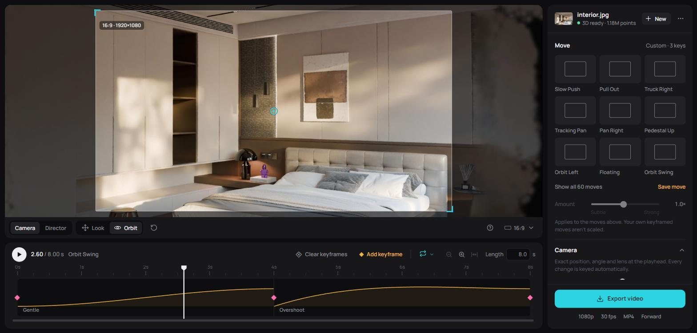

# SharpRig

Turn a single photo into a cinematic camera move, entirely in the browser.

**[Live demo](https://sm079.github.io/sharp-rig/)** (Chrome or Edge with WebGPU; real 3D needs a one-time 0.7 GB model download)

[Apple's SHARP](https://github.com/apple/ml-sharp) lifts the photo into a metric 3D Gaussian scene. You then direct a 6DoF camera through it, with presets or your own keyframes, and export an MP4 or WebM. Inference (ONNX Runtime Web on WebGPU), splat rendering (WebGL2) and video encoding (WebCodecs) all run client-side. There is no backend, and nothing is uploaded.



```bash
npm install
npm run dev      # http://localhost:5173
npm run build    # static site in dist/
```

Without the model, photos get a heuristic *preview depth*, so the editor works straight away. See [Running SHARP in the browser](#running-sharp-in-the-browser) for real reconstructions.

## Highlights

- **Single-image 3D in the browser.** SHARP (~700M parameters) runs on WebGPU from a 0.66 GB int8 weight pack. The pack is expanded to fp16 while it streams in, then cached.
- **The viewport is the camera.** The canvas shows the scene around the shot, with the output frame outlined, so what's inside the outline is exactly what gets exported. Any aspect ratio works: presets, the photo's own, or custom (e.g. 2.39:1).
- **Two ways to move.** *Look* is free 6DoF. *Orbit* puts the camera on a rigid arm around a pivot you drop onto any surface. A pivot in front of the camera orbits the subject; one behind, above or to the side gives jib, boom, pendulum and swing-door moves.
- **Keyframes with auto-key.** Any camera change is captured at the playhead. Each segment between two keys has its own easing curve, which you can shape with bezier handles or sketch freehand, and its own route: a straight line, a smooth spline, or an arc around the pivot.
- **60 presets.** Their amplitudes are scaled per scene with SHARP's own max-disparity heuristic, so moves stay within what a single image can render.
- **Deterministic export** at 720p to 4K and 24/30/60 fps, as H.264 MP4 or VP9 WebM, optionally back and forth for seamless loops.

## Motion model

```
Viewport → pose keyframes → segments → easing
```

- A **keyframe** stores a full pose (position, orientation quaternion, lens zoom) and, if it was made in Orbit mode, its pivot.
- Each **segment** between two keys has one easing curve E(u): one of 34 named curves, a cubic bezier, or a hand-drawn curve sampled at 33 points and interpolated with Catmull-Rom. A drawn curve is pinned to 0 and 1 at its ends, so the camera lands exactly on each key.
- **Orientation** is interpolated with slerp. **Position** is interpolated linearly, with a Catmull-Rom spline through the neighbouring keys, or as a **pivot arc**. For the arc, the arm vector is interpolated in the camera's local frame and re-attached to the slerped orientation, so orbits keep their radius.
- Saved and exported motions are stored relative to the subject distance, so they transfer between scenes.

Coordinates follow SHARP / OpenCV: +x right, +y down, +z forward, in metres, with the photo's camera at the origin.

## Running SHARP in the browser

Export the checkpoint once:

```bash
git clone https://github.com/apple/ml-sharp && cd ml-sharp
pip install -e . onnx     # PyTorch with CUDA, for fp16 tracing
python path/to/sharp-rig/tools/export_sharp_onnx.py --int8 -c sharp_2572gikvuh.pt -o path/to/sharp-rig/public/models/sharp.onnx
```

| File | Size | |
|---|---|---|
| `sharp.onnx` | 4 MB | graph, traced in fp16 (fp32 inputs and outputs) |
| `sharp.int8.bin` | 0.66 GB | int8 weights + per-output-channel scales; what the app downloads |
| `sharp.onnx.data` | 1.31 GB | fp16 weights; only needed to rebuild the pack |

By default the app looks for `models/sharp.onnx` and `models/sharp.int8.bin` next to itself and loads them on startup. Set `VITE_MODEL_BASE_URL` at build time to load them from elsewhere. The live demo uses the export hosted at [sm079/sharp-onnx-webgpu](https://huggingface.co/sm079/sharp-onnx-webgpu) on Hugging Face. A model on another origin is only loaded automatically once it's in the browser cache. On a first visit, people choose to start the download.

The int8 pack is expanded to fp16 while it downloads and kept in Cache Storage. Inference runs on WebGPU and falls back to WASM if a WebGPU run fails. Requests to the worker are serialised, and a watchdog resets and reloads the model if a GPU run stops responding.

The parts of SHARP's pipeline outside the network are done in TypeScript:
- NDC → metric unprojection (`x·W/2f`, `y·H/2f`, applied to means and covariances). This avoids the SVD that ONNX can't express.
- Linear → sRGB conversion.
- EXIF-based focal length, matching `sharp.utils.io.load_rgb`.

`tools/make_stub_onnx.py` builds a tiny model with the same signature, for testing the pipeline without the checkpoint.

### Weight quantisation

WebGPU has no fp8 or fp4 matmul, so quantised formats are used for **storage** only. Weights are expanded to fp16 on load, and inference is plain fp16. Measured on SHARP (weight-only, round-to-nearest, compared with the fp32 model):

| Format | Download | Depth rel. error, median / p95 | Opacity MAE |
|---|---|---|---|
| fp16 | 1.40 GB | 0.08% / 0.26% | 0.027 |
| **int8 per-channel** (used) | **0.70 GB** | **0.19% / 1.1%** | **0.019** |
| MXFP8 E4M3, block 32 | 0.73 GB | 1.0% / 2.3% | 0.040 |
| NVFP4, block 16 | 0.40 GB | 4.7% / 6.6% | 0.152 |
| int4, group 32/64 | 0.40–0.44 GB | 2–4% / 5–14% | 0.12–0.13 |

4-bit formats would need calibration (AWQ / GPTQ) or mixed precision to be usable. With int8 weights, depth quantiles stay within 1–3% of PyTorch fp32.

## Deploying

`npm run build` produces a static site with relative paths, so it works from any subdirectory. `.github/workflows/deploy.yml` publishes it to GitHub Pages on every push to `main`. It takes the model location from the repository variable `MODEL_BASE_URL`. The weights are too large for Pages, so they're hosted separately.

## Architecture

```
src/engine/     Studio: the UI-agnostic engine (scene, model, camera rig, motion, playback,
                auto-key, undo, render loop, export) with typed events
src/splat/      WebGL2 Gaussian renderer (OpenCV pinhole), depth-sort worker, .ply I/O
src/inference/  SHARP worker (ONNX Runtime Web), int8 weight pack, EXIF focal, preview depth
src/camera/     viewport controller (free 6DoF + pivot rig), output lens model
src/motion/     pose / keyframe / segment model, easing library, presets
src/export/     deterministic frame rendering, WebCodecs → MP4 / WebM
src/ui/         the editor UI, built on the Studio
tools/          SHARP → ONNX export, stub model
```

The engine knows nothing about layout. It owns the `<canvas>`, exposes methods, and emits typed events (`scene`, `motion`, `selection`, `time`, `settings`, `frame`, …). A UI implements `StudioUI` (`src/ui/types.ts`): it mounts itself around a live Studio and returns a cleanup function. The editor UI is plain TypeScript and DOM, with no framework.

## Model license

SHARP's weights are released by Apple under the [Apple Machine Learning Research Model License](https://github.com/apple/ml-sharp/blob/main/LICENSE_MODEL), which permits non-commercial research use only. The ONNX export and int8 pack are derivatives of those weights and carry the same terms. The weights are not included in this repository.
